```
╔══════════════════════════════════════════════════════════════════╗
║  DOCUMENT: AL-ATP-001-HAZ                                        ║
║  TITLE:    Hazard Identification & Morphological Mimicry         ║
║  STATUS:   ACTIVE                                                ║
╚══════════════════════════════════════════════════════════════════╝
```

---

# ⚠️ Hazard Identification & Morphological Mimicry

> [!warning] Why This Document Exists
> Some vegetables look almost identical but taste completely different. This happens to everyone, including people who've been cooking for years.
> 
> Here's how to tell them apart so you don't accidentally eat wet dirt.

---

## §2.1 The Red Sphere Protocol

### Substrate Confusion: Beets vs. Radishes

These are both red, round, and pulled from the ground. But one is crunchy and peppery, and the other tastes like someone distilled the essence of a garden.

| Parameter | Beet | Radish |
|-----------|------|--------|
| **Appearance** | Deep red, spherical | Red/pink, spherical (usually smaller) |
| **Interior** | Dark red throughout | White interior |
| **Texture** | Dense, firm | Crisp, snappy |
| **Raw consumption** | ❌ Not recommended | ✅ Perfectly fine |
| **Flavor if eaten raw** | *Geosmin* (wet potting soil) | Peppery, crisp |

> [!tip] Identification Method: Thumbnail Hardness Test
> Apply thumbnail pressure to the substrate surface.
> 
> | Result | Identification | Action |
> |--------|---------------|--------|
> | Punctures easily with a snap | **Radish** | Raw consumption authorized |
> | Resists puncture, feels dense | **Beet** | Thermal processing mandatory |
> 
> **Beets need to be cooked.** They're not dangerous raw, they just taste like dirt and disappointment.

---

## §2.2 The "Neon Celery" Ambiguity

### Substrate Confusion: Chard vs. Rhubarb

Both have colorful stalks (pink, red, yellow) with leafy green tops. One is a vegetable you can eat entirely. The other has toxic leaves.

| Parameter | Swiss Chard | Rhubarb |
|-----------|-------------|---------|
| **Appearance** | Large floppy leaves, colorful stems | Large leaves, thick red/green stalks |
| **Leaf texture** | Tender, edible | Tough, **TOXIC** |
| **Stalk** | Thin to medium, flexible | Very thick, rigid |
| **Found in** | Produce section | Produce section OR garden |

> [!success] Easy Identification
> **If you're in the produce section and it has intact edible-looking leaves attached:** It's Swiss Chard.
> 
> Rhubarb is usually sold as stalks only (leaves removed) specifically because the leaves contain oxalic acid.
> 
> **Chard = safe, entire plant edible, use in [[Protocol C - Stovetop-Assisted Wilting|ATP-C]]**

> [!danger] Rhubarb Leaf Warning
> If you somehow acquire rhubarb with leaves still attached:
> - Stalks = edible (usually for desserts)
> - Leaves = **do not consume** (oxalic acid)
> 
> But honestly, if you're at H-Mart looking at leafy greens, it's chard.

---

## §2.3 The White Bulb Check

### Substrate Confusion: Onion vs. Turnip

Both are white, round, and roughly the same size. But they have completely different functions in cooking.

| Parameter | Onion | Turnip |
|-----------|-------|--------|
| **Function** | Flavor base (aromatic) | Texture component (like a mild potato) |
| **Interior** | Concentric layers | Solid homogeneous mass |
| **Aroma when cut** | Strong, may cause eye irritation | Mild, slightly peppery |
| **Outer layer** | Papery, dry skin | Thin skin, often with purple top |

> [!tip] Identification Method: Bisection Analysis
> Cut it in half. Look at the cross-section.
> 
> | Internal Structure | Identification | Deployment |
> |--------------------|----------------|------------|
> | Concentric rings/layers | **Onion** 🧅 | Use as flavor base (ATP-A, ATP-B) |
> | Solid, uniform mass | **Turnip** 🥔 | Use as texture component only |
> 
> **Do NOT use turnip as a flavor base.** It will not release aromatic compounds like onion does. Your dish will taste flat and vaguely of regret.

```mermaid
flowchart TD
    A[White Spherical Substrate] --> B{Bisect and Inspect}
    B --> C{Internal Structure?}
    C -->|Concentric Layers| D[🧅 ONION]
    C -->|Solid Homogeneous Mass| E[🥔 TURNIP]
    D --> F[Deploy as Flavor Base]
    E --> G[Deploy as Texture Component]
    F --> H[Protocols A, B]
    G --> I[NOT a flavor base substitute]
```



---

## Hazard Summary Matrix

| Substrate A | Substrate B | Confusion Risk | Test Method | Recovery if Wrong |
|-------------|-------------|----------------|-------------|-------------------|
| Beet | Radish | HIGH | Thumbnail Hardness | Salvageable (cook the beet) |
| Chard | Rhubarb | MODERATE | Context + Leaf check | Don't eat rhubarb leaves |
| Onion | Turnip | MODERATE | Bisection Analysis | Restart with correct substrate |

---

## General Guidance

> [!info] It's Okay to Double-Check
> There's no shame in Googling a vegetable at the grocery store. Everyone does it.
> 
> The PLU sticker on the produce will also tell you exactly what it is—see [[PLU Reference]] for code interpretation.

> [!note] When In Doubt
> If you're at H-Mart or T&T and genuinely unsure what something is:
> 1. Check the PLU sticker
> 2. Check the signage (usually in English + Korean/Chinese)
> 3. Ask someone—staff at Asian grocery stores are generally very helpful
> 
> **Better to ask than to find out mid-protocol that you grabbed the wrong substrate.**

---

## See Also

- [[Equipment & Materials]] — PPE requirements for handling
- [[Procurement]] — Where to acquire substrates with PLU codes
- [[PLU Reference]] — Decoding produce stickers
- [[Protocol A - Aqueous Phase Extraction|ATP-A]] — Uses onion, potato, zucchini
- [[Protocol B - Exothermic Surface Reaction|ATP-B]] — Uses onion, cabbage, carrot
- [[Protocol C - Stovetop-Assisted Wilting|ATP-C]] — Uses chard or kale

---

<footer>
<center>

─────────────────────────────────────────────────────────

**AERYEOK LABS** | Advanced Development Programs

Document: AL-ATP-001-HAZ | Status: ACTIVE

─────────────────────────────────────────────────────────

*When in doubt, cut it open. The inside never lies.* 🔪

</center>
</footer>
