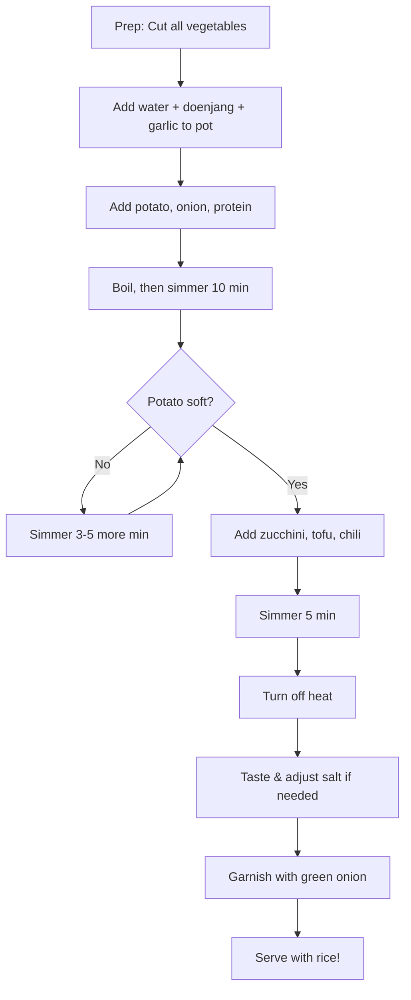

```
╔══════════════════════════════════════════════════════════════════╗
║  PROTOCOL: AL-ATP-001-A                                          ║
║  CODENAME: Aqueous Phase Extraction                              ║
║  OUTPUT:   Thermal Hydrolysate (된장찌개, Doenjang-jjigae)         ║
║  STATUS:   EXPERIMENTAL                                          ║
╚══════════════════════════════════════════════════════════════════╝
```

---

# 🔬 ATP-A: Aqueous Phase Extraction

> [!abstract] What You're Making
> A savory fermented soybean stew with vegetables and protein.
> 
> **Why this protocol is good for beginners:**
> - Very forgiving—hard to mess up
> - One pot, minimal active work
> - You're basically just boiling things in flavored water
> - It'll taste good even if proportions are slightly off

---

## Protocol Parameters

| Parameter | Value |
|-----------|-------|
| **Primary Reagent** | [[Doenjang\|Reagent D]] (Fermented soybean paste) |
| **Thermal Method** | Aqueous hydrolysis (boiling in liquid) |
| **Duration** | ~20 minutes |
| **Active Effort** | Low—mostly waiting |
| **Difficulty** | ⭐ (you've got this) |

---

## Required Materials

### Hardware

*Reference: [[Equipment & Materials]]*

- [ ] Large pot (3–4 L)
- [ ] Stovetop
- [ ] Knife + cutting board
- [ ] Wooden spoon or spatula
- [ ] Fork or chopstick (for poking potatoes)
- [ ] Oven mitts

### Ingredients

*Reference: [[Procurement]]*

| Item | Quantity | Notes |
|------|----------|-------|
| Water (or rice rinse water) | ~500mL (2 cups) | Rice water is better but not required |
| [[Doenjang\|Reagent D]] | 2 tbsp (~30g) | The fermented soybean paste |
| Garlic | 1 tbsp minced (~3–4 cloves) | Pre-minced from a jar is fine |
| Potato | 1–2 medium | Cut into bite-sized chunks |
| Onion | 1 medium | Cut into chunks |
| Beef or Pork | ~200g thinly sliced | Or skip for vegetarian |
| Zucchini | 1 small | Sliced into half-moons |
| Firm Tofu | ½ block | Cut into 2cm cubes |
| Fresh Chili | 1–2 | Sliced diagonally (optional, for heat) |
| Green Onion | 2 stalks | Sliced, for garnish |

---

## Synthesis Procedure

### Step A.1: Prepare Your Ingredients

Before you turn on the stove, cut everything up.

```
┌─────────────────────────────────────────────────────────┐
│  SUBSTRATE PREPARATION                                  │
├─────────────────────────────────────────────────────────┤
│  • Potato → Bite-sized chunks (2-3 cm cubes)           │
│  • Onion → Rough chunks (don't need to be pretty)      │
│  • Zucchini → Half-moon slices (1 cm thick)            │
│  • Tofu → 2 cm cubes (handle gently)                   │
│  • Chili → Diagonal slices                              │
│  • Green onion → Sliced thin                            │
└─────────────────────────────────────────────────────────┘
```

> [!tip] Tofu Handling
> Tofu is fragile. Cut it gently and don't stir it aggressively later, or it'll fall apart into sad little pieces.

---

### Step A.2: Build Your Base

```
1. Add 500mL water (or rice rinse water) to your pot
2. Add 2 tbsp doenjang (Reagent D)
3. Add 1 tbsp minced garlic
4. Stir until the doenjang dissolves
```

> [!note] Rice Rinse Water
> If you're making rice to go with this (recommended), save the cloudy water from rinsing the rice. It adds body to the stew.
> 
> Don't have it? Regular water is fine. This isn't a critical variable.

---

### Step A.3: Primary Hydrolysis (First Boil)

```
1. Add potato and onion to the pot
2. Add protein (beef or pork) if using
3. Turn heat to HIGH
4. Bring to a boil
5. Reduce heat to maintain a simmer
6. Cook for 10 minutes
```

> [!check] QC Checkpoint: Potato Test
> After 10 minutes, poke a potato chunk with a fork.
> 
> | Result | Action |
> |--------|--------|
> | Fork slides in easily | ✅ Proceed to next step |
> | Fork meets resistance | Continue simmering 3–5 more minutes |
> 
> Potatoes need to be soft. They're the indicator that your stew is done.

---

### Step A.4: Secondary Hydrolysis (Add Soft Ingredients)

```
1. Add zucchini slices
2. Add tofu cubes (gently lower them in)
3. Add chili slices (if using)
4. Maintain simmer for 5 more minutes
```

> [!caution] Gentle with the Tofu
> Don't stir aggressively after adding tofu. Just let it sit in the simmering liquid. It'll cook through.

---

### Step A.5: Final Assembly

```
1. Turn off heat
2. Taste the broth—if it needs more salt, add a splash of soy sauce
3. Ladle into a bowl
4. Top with sliced green onion
5. Serve with rice
```

> [!success] You Did It
> That's it. You made doenjang-jjigae. It should be savory, a little earthy, with soft vegetables floating in a rich broth.
> 
> **Serve it in the pot or in individual bowls, with rice on the side.**

---

## Process Flow



---

## Output Specifications

| Parameter | Specification |
|-----------|---------------|
| **Serving Temperature** | Hot |
| **Pairs With** | Steamed rice (pretty much required) |
| **Servings** | 2–3 portions |
| **Storage** | Refrigerate up to 3 days |
| **Reheating** | Stovetop until bubbling; add splash of water if too thick |

---

## Troubleshooting Matrix

| Observation | Probable Cause | Corrective Action |
|-------------|----------------|-------------------|
| Too salty | Too much doenjang | Add more water to dilute |
| Too bland | Not enough doenjang | Add more doenjang or a splash of soy sauce |
| Potatoes still hard | Insufficient cooking time | Keep simmering until fork-tender |
| Tofu fell apart | Too much stirring | Cosmetic only—still tastes fine |
| Weird funky smell | That's just doenjang | It's supposed to smell fermented. Taste it—it'll be good |

> [!note] On the Smell
> Doenjang smells... fermented. Kind of funky. This is normal. Once everything cooks together, it becomes savory and delicious. Trust the process.

---

## Operator Notes

> [!info] This Is the Easiest Protocol
> If you can boil water and cut vegetables, you can make this. The timing is forgiving, the proportions are flexible, and even "mistakes" usually taste fine.
> 
> **Remember:** This protocol was designed by someone who has never tasted it. If you make it and it tastes good, log the result and notify PI. That means the protocol works.

---

## See Also

- [[Protocol B - Exothermic Surface Reaction|ATP-B]] — Spicy stir-fried pork (more active cooking)
- [[Protocol C - Stovetop-Assisted Wilting|ATP-C]] — Seasoned greens (fast side dish)
- [[Doenjang|Reagent D]] — About the fermented soybean paste
- [[Procurement]] — Shopping list

---

<footer>
<center>

─────────────────────────────────────────────────────────

**AERYEOK LABS** | Advanced Development Programs

Protocol: AL-ATP-001-A | Status: EXPERIMENTAL

─────────────────────────────────────────────────────────

*It's just boiling things in flavored water. You've done harder labs than this.* 🍲

</center>
</footer>
