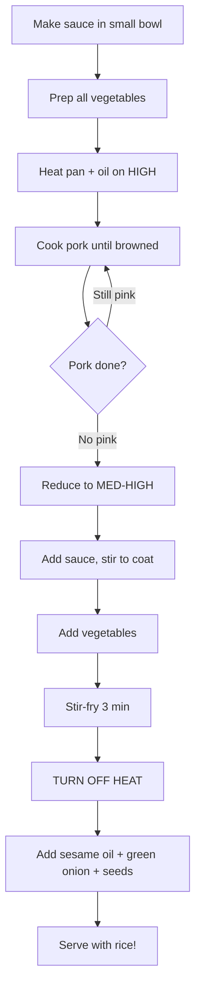

```
╔══════════════════════════════════════════════════════════════════╗
║  PROTOCOL: AL-ATP-001-B                                          ║
║  CODENAME: Exothermic Surface Reaction                           ║
║  OUTPUT:   Maillard Compound (제육볶음, Jeyuk-bokkeum)            ║
║  STATUS:   EXPERIMENTAL                                          ║
╚══════════════════════════════════════════════════════════════════╝
```

---

# 🔥 ATP-B: Exothermic Surface Reaction

> [!abstract] What You're Making
> Spicy stir-fried pork belly with vegetables in a sweet-spicy gochujang sauce.
> 
> **Why this protocol requires more attention:**
> - High heat means things happen fast
> - You need to prep everything BEFORE you start cooking
> - Once you're cooking, you can't walk away
> - But it's still very doable

---

## Protocol Parameters

| Parameter | Value |
|-----------|-------|
| **Primary Reagent** | [[Gochujang\|Reagent G]] + [[Gochugaru\|Reagent K]] (Dual-chili system) |
| **Thermal Method** | Exothermic surface reaction (stir-frying) |
| **Duration** | ~15 minutes active cooking |
| **Active Effort** | Moderate-High—you're stirring the whole time |
| **Difficulty** | ⭐⭐ (requires focus but absolutely doable) |

> [!warning] Key Difference from ATP-A
> Unlike the stew (ATP-A), you cannot walk away during this protocol. High heat + oil + sugar = things can burn if unattended.
> 
> **Have everything prepped and ready before you turn on the heat.**

---

## Required Materials

### Hardware

*Reference: [[Equipment & Materials]]*

- [ ] Large pan or wok (~30 cm diameter)
- [ ] Stovetop
- [ ] Knife + cutting board
- [ ] Small bowl (for mixing the sauce)
- [ ] Spatula or wooden spoon
- [ ] Oven mitts
- [ ] Apron (oil will splatter)

### Ingredients

*Reference: [[Procurement]]*

**For the Sauce (mix this first):**

| Item | Quantity | Notes |
|------|----------|-------|
| [[Gochujang\|Reagent G]] | 2 tbsp (~30g) | The red fermented chili paste |
| [[Gochugaru\|Reagent K]] | 1 tbsp (~15mL) | Korean chili flakes |
| Soy Sauce | 1 tbsp (~15mL) | — |
| Sugar | 1 tbsp (~15g) | — |
| Water | 2 tbsp (~30mL) | Thins the sauce so it doesn't burn |
| Ginger | 1 tsp minced (~5mL) | — |
| Garlic | 1 tbsp minced (~15mL) | — |

**For Cooking:**

| Item | Quantity | Notes |
|------|----------|-------|
| Cooking Oil | 1 tbsp | Vegetable, canola, anything neutral |
| Pork Belly | ~300g thinly sliced | Pre-sliced from H-Mart is ideal |
| Cabbage | ¼ head | Cut into 3cm ribbons |
| Carrot | 1 medium | Julienned (thin matchsticks) |
| Onion | 1 medium | Sliced into thin crescents |
| Green Onion | 2 stalks | Sliced (added at the end) |
| Sesame Oil | 1 tbsp (~15mL) | Added OFF heat at the end |
| Sesame Seeds | ~5g | Garnish |

---

## Pre-Synthesis: Make the Sauce FIRST

> [!danger] Critical Pre-Step
> **Mix the sauce before you turn on the heat.**
> 
> Once you start cooking, things move fast. You don't want to be measuring ingredients while your pork is burning.

```
┌─────────────────────────────────────────────────────────┐
│  SLURRY PREPARATION (do this first!)                    │
├─────────────────────────────────────────────────────────┤
│  In a small bowl, combine:                              │
│                                                         │
│  • 2 tbsp gochujang (Reagent G)                        │
│  • 1 tbsp gochugaru (Reagent K)                        │
│  • 1 tbsp soy sauce                                     │
│  • 1 tbsp sugar                                         │
│  • 2 tbsp water                                         │
│  • 1 tsp minced ginger                                  │
│  • 1 tbsp minced garlic                                 │
│                                                         │
│  Stir until combined. Set aside.                        │
└─────────────────────────────────────────────────────────┘
```

> [!tip] Why the Water?
> The water thins the sauce so it coats the meat instead of clumping and burning on the hot pan. Don't skip it.

---

## Step B.1: Prep All Your Ingredients

Before you turn on the stove, everything should be cut and ready:

```
┌─────────────────────────────────────────────────────────┐
│  SUBSTRATE PREPARATION                                  │
├─────────────────────────────────────────────────────────┤
│  • Pork belly → Already sliced thin (use as-is)        │
│  • Cabbage → 3cm wide ribbons                           │
│  • Carrot → Thin matchsticks (julienne)                │
│  • Onion → Thin crescent slices                         │
│  • Green onion → Sliced (set aside for end)            │
└─────────────────────────────────────────────────────────┘
```

Arrange everything within arm's reach of the stove. Once you start, you won't have time to go looking for things.

---

## Step B.2: Cook the Pork

```
1. Add 1 tbsp cooking oil to your pan/wok
2. Set heat to HIGH
3. Wait until the oil shimmers (this means it's hot)
4. Add the pork belly slices
5. Spread them out—don't pile them up
6. Let them sear for 1–2 minutes, then stir
7. Continue cooking until:
   - No pink visible
   - Edges are starting to brown
   - Some fat has rendered out
```

> [!caution] Splatter Warning
> When pork fat hits a hot pan, it spits. This is normal. Keep your face back and consider wearing an apron.
> 
> If you have a splatter screen, use it. If not, just be aware.

> [!check] QC Checkpoint: Pork Done
> | Visual Indicator | Status |
> |------------------|--------|
> | Pink visible anywhere | Keep cooking |
> | All surfaces white/brown, some crispy edges | ✅ Proceed |

---

## Step B.3: Add the Sauce

```
1. Reduce heat to MEDIUM-HIGH
2. Pour in the prepared sauce
3. Stir quickly to coat all the pork
4. Let it sizzle for about 60 seconds
```

The sauce should bubble and coat the meat. If it's pooling and not coating, your heat might be too low.

> [!note] That Sizzle Sound
> You want to hear aggressive sizzling. If it's quiet, the pan isn't hot enough. If things are burning and smoking, reduce heat slightly.

---

## Step B.4: Add the Vegetables

```
1. Add cabbage
2. Add carrot
3. Add onion
4. Stir everything together
5. Continue cooking for 3 minutes, stirring frequently
```

The vegetables should soften but still have some crunch. You're not trying to make them mushy.

> [!check] QC Checkpoint: Vegetables
> | Observation | Status |
> |-------------|--------|
> | Cabbage wilted but still has texture | ✅ Perfect |
> | Carrots slightly softened but not limp | ✅ Perfect |
> | Everything coated in red sauce | ✅ Perfect |
> | Vegetables are mush | Overcooked (still edible, just softer) |

---

## Step B.5: Finish (Off Heat!)

```
1. TURN OFF THE HEAT
2. Add 1 tbsp sesame oil
3. Add sliced green onion
4. Add sesame seeds
5. Stir once to combine
6. Serve immediately with rice
```

> [!warning] Sesame Oil Goes In AFTER Heat Is Off
> Sesame oil has a low smoke point and loses its flavor when heated too much. Add it at the end when the pan is off the burner. It's a finishing oil, not a cooking oil.

---

## Process Flow



---

## Output Specifications

| Parameter | Specification |
|-----------|---------------|
| **Serving Temperature** | Hot |
| **Pairs With** | Steamed rice (essential) |
| **Visual** | Glossy red-orange sauce coating everything |
| **Servings** | 2–3 portions |
| **Storage** | Refrigerate up to 3 days |
| **Reheating** | Medium heat in pan, add splash of water to rehydrate |

---

## Troubleshooting Matrix

| Observation | Probable Cause | Corrective Action |
|-------------|----------------|-------------------|
| Pork is burning before browning | Pan too hot | Reduce heat; add splash of water if needed |
| Sauce is clumpy, not coating | Forgot the water in sauce | Add 2 tbsp water now, stir vigorously |
| Too spicy | More gochujang/gochugaru than tolerance allows | Add more sugar (1–2 tsp) to balance |
| Not spicy enough | Not enough chili components | Add more gochugaru |
| Vegetables are mushy | Cooked too long | Cosmetic issue—still tastes fine |
| Everything is black and smoking | Heat was too high, unattended | Start over, lower heat next time |

> [!note] On Spice Levels
> If you're not sure about your heat tolerance, start with half the gochugaru (½ tbsp). You can always add more next time.
> 
> Gochujang provides some sweetness, so reducing it changes the flavor more than just reducing heat.

---

## Operator Notes

> [!info] This Requires Attention But You Can Do It
> The key is prep work. If everything is cut and the sauce is mixed before you turn on the stove, you're just moving things around in a pan.
> 
> **Read through the whole protocol once before starting.** Know what's coming next so you're not surprised.
> 
> The whole active cooking time is only about 8–10 minutes. You can focus for 10 minutes.

---

## See Also

- [[Protocol A - Aqueous Phase Extraction|ATP-A]] — Doenjang stew (easier, more passive)
- [[Protocol C - Stovetop-Assisted Wilting|ATP-C]] — Seasoned greens (quick side dish)
- [[Gochujang|Reagent G]] — About the fermented chili paste
- [[Gochugaru|Reagent K]] — About the chili flakes
- [[Procurement]] — Shopping list

---

<footer>
<center>

─────────────────────────────────────────────────────────

**AERYEOK LABS** | Advanced Development Programs

Protocol: AL-ATP-001-B | Status: EXPERIMENTAL

─────────────────────────────────────────────────────────

*Prep first, cook fast, eat well.* 🔥

</center>
</footer>
