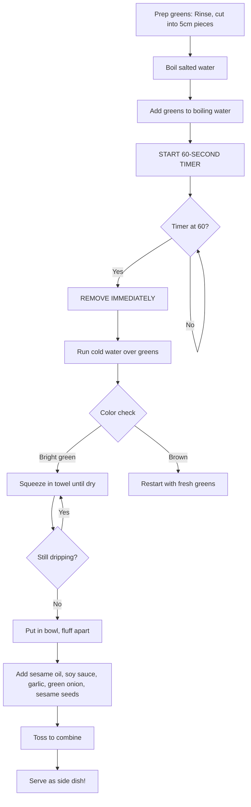

```
╔══════════════════════════════════════════════════════════════════╗
║  PROTOCOL: AL-ATP-001-C                                          ║
║  CODENAME: Stovetop-Assisted Wilting                             ║
║  OUTPUT:   Compressed Biomass (나물, Namul)                       ║
║  STATUS:   EXPERIMENTAL                                          ║
╚══════════════════════════════════════════════════════════════════╝
```

---

# 🥬 ATP-C: Stovetop-Assisted Wilting

> [!abstract] What You're Making
> A Korean side dish of seasoned blanched greens. Tender but not mushy, dressed with sesame oil, soy sauce, and garlic.
> 
> **Why this protocol is fast:**
> - Total time: ~10 minutes
> - Minimal ingredients
> - Great way to eat your vegetables
> - Makes a good side dish for ATP-A or ATP-B

---

## Protocol Parameters

| Parameter | Value |
|-----------|-------|
| **Primary Reagent** | Sesame Oil + Soy Sauce |
| **Thermal Method** | Aqueous blanching (quick boil) + cold shock |
| **Duration** | ~10 minutes total |
| **Active Effort** | Low |
| **Difficulty** | ⭐ (easy, but timing matters) |

> [!danger] Critical Factor: TIMING
> You have exactly **60 seconds** of blanching time. This is the one part you can't be casual about.
> 
> Set a timer. Do not eyeball it.

---

## Required Materials

### Hardware

*Reference: [[Equipment & Materials]]*

- [ ] Medium pot (2–3 L)
- [ ] Stovetop
- [ ] Colander or strainer
- [ ] Clean kitchen towel
- [ ] Medium bowl
- [ ] **Timer** ⚠️ (use your phone)
- [ ] Oven mitts

### Ingredients

*Reference: [[Procurement]]*

| Item | Quantity | Notes |
|------|----------|-------|
| Swiss Chard OR Kale | 1 bunch | Either works; chard is more tender |
| Salt | 1 tsp | For the boiling water |
| Sesame Oil | 1 tbsp (~15mL) | — |
| Soy Sauce | 1 tbsp (~15mL) | — |
| Garlic | ½ tsp minced (~2.5mL) | Raw, not cooked |
| Green Onion | 1 tbsp chopped (~15mL) | — |
| Sesame Seeds | ~5g | **Mandatory**—not optional |

---

## The Science: Why 60 Seconds?

> [!info] Brief Explanation
> Leafy greens contain chlorophyll, which gives them their bright green color. When you boil greens:
> 
> | Time | What Happens |
> |------|--------------|
> | 0–30 sec | Cells start to collapse, greens wilt |
> | 30–60 sec | Perfect tenderness, color stays bright |
> | >60 sec | Chlorophyll degrades → olive/brown color |
> | >90 sec | Texture becomes mushy, water-logged |
> 
> **The 60-second window gives you tender greens that are still vibrant green.** Past that, they get sad.

---

## Synthesis Procedure

### Step C.1: Prepare the Greens

```
1. Separate leaves from stems
2. Rinse thoroughly under running water
3. Cut into 5cm (~2 inch) segments
```

> [!tip] Stems vs. Leaves
> Stems take longer to cook than leaves. For this protocol, we're focusing on the leaves.
> 
> You can save the stems for another use (stir-fry, soup) or discard them if you want to keep things simple.

---

### Step C.2: Boil Water

```
1. Fill your pot about ⅔ full with water
2. Add 1 tsp salt
3. Turn heat to HIGH
4. Wait for a rolling boil (big bubbles, not just simmering)
```

While the water is heating, set up your colander in the sink and have a bowl of cold water ready nearby.

---

### Step C.3: Blanch (THE CRITICAL STEP)

```
1. Add greens to boiling water
2. START YOUR TIMER IMMEDIATELY
3. Push them under the water with a spoon if they float
4. Watch the clock
5. AT 60 SECONDS: Remove immediately
```

> [!danger] 60 SECONDS. NOT LONGER.
> 
> | Timer | Action |
> |-------|--------|
> | 0:00 | Greens go in, start timer |
> | 0:30 | They should be wilting, color intensifying |
> | 0:60 | **REMOVE NOW** |
> | 0:61+ | You're overcooking |
> 
> **Set a timer. Say it out loud: "Sixty seconds." Don't get distracted.**

---

### Step C.4: Cold Shock

```
1. Immediately transfer greens to colander
2. Run cold water over them (or dunk in ice water bowl)
3. Continue until greens are room temperature/cool
```

> [!note] Why Cold Shock?
> The cold water stops the cooking process instantly. If you skip this, residual heat continues to cook the greens and they'll go past optimal.

> [!check] QC Checkpoint: Color Check
> | Observation | Status |
> |-------------|--------|
> | Bright, vibrant green | ✅ Proceed |
> | Slightly olive tint | ⚠️ Slightly overcooked (still usable) |
> | Brown edges | ❌ Overcooked (start over with fresh greens) |

---

### Step C.5: Squeeze Out Water

This is important. Wet greens = watery namul.

```
1. Take a handful of greens
2. Wrap in your clean kitchen towel
3. Squeeze firmly over the sink
4. Repeat until no water drips out
5. You should end up with a dense ball of greens
```

> [!tip] Squeeze Hard
> Really squeeze. You want to remove as much water as possible. The greens should feel dense and compact, not wet and loose.
> 
> If you're uncertain, squeeze again. Drier is better.

---

### Step C.6: Season

```
1. Put the squeezed greens in your bowl
2. Fluff them apart with your fingers or tongs
3. Add:
   - 1 tbsp sesame oil
   - 1 tbsp soy sauce
   - ½ tsp minced raw garlic
   - 1 tbsp chopped green onion
   - 5g sesame seeds
4. Toss everything together
```

> [!warning] Sesame Seeds Are Mandatory
> They provide texture and are essential to the namul profile. This isn't optional garnish.

> [!success] Done!
> Taste it. If it needs more salt, add a splash more soy sauce. If it needs more nuttiness, add more sesame oil.
> 
> **Serve at room temperature or cold.** This is a side dish (banchan).

---

## Process Flow



---

## Output Specifications

| Parameter | Specification |
|-----------|---------------|
| **Serving Temperature** | Room temperature or cold |
| **Classification** | Banchan (Korean side dish) |
| **Servings** | 2–4 small portions |
| **Storage** | Refrigerate up to 5 days |
| **Reheating** | Not required—serve cold or room temp |

---

## Troubleshooting Matrix

| Observation | Probable Cause | Corrective Action |
|-------------|----------------|-------------------|
| Greens are olive/brown | Exceeded 60 seconds | Cannot fix; start over with fresh greens |
| Watery/soggy texture | Not squeezed enough | Squeeze again in dry towel |
| Bland | Under-seasoned | Add more soy sauce and sesame oil |
| Tough/chewy | Didn't blanch long enough | Next time, ensure full 60 seconds |
| Missing crunch | Forgot sesame seeds | Add sesame seeds now |
| Too garlicky | Used too much garlic | It'll mellow as it sits; or start over |

---

## Operator Notes

> [!info] Speed Round
> This is a quick protocol. Once you've done it once, you can make it in under 10 minutes while something else is cooking.
> 
> **It's a good "side quest" while ATP-A is simmering.** Start the namul, and by the time you're done, your stew is ready.

> [!note] Timing Matters Here
> I keep emphasizing the 60 seconds because this is the one protocol where timing really does matter. ATP-A and ATP-B are forgiving—a few minutes either way won't ruin anything. But blanching greens has a narrow window.
> 
> **Set. A. Timer.**

---

## See Also

- [[Protocol A - Aqueous Phase Extraction|ATP-A]] — Doenjang stew (pairs well with namul)
- [[Protocol B - Exothermic Surface Reaction|ATP-B]] — Spicy pork stir-fry (also pairs well)
- [[Procurement]] — Shopping list
- [[Equipment & Materials]] — Chronometer requirements

---

<footer>
<center>

─────────────────────────────────────────────────────────

**AERYEOK LABS** | Advanced Development Programs

Protocol: AL-ATP-001-C | Status: EXPERIMENTAL

─────────────────────────────────────────────────────────

*60 seconds. Timer. You've got this.* ⏱️

</center>
</footer>
